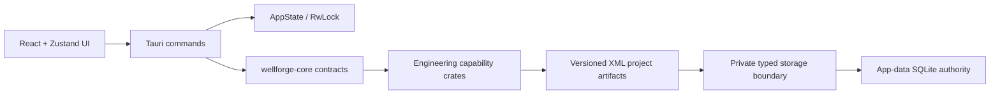

# WellForge

WellForge is a local-first desktop drilling-engineering suite. It is built with Tauri 2, Rust 2024, React 18, TypeScript, Vite, Zustand, and Tailwind CSS.

Prompt 0 establishes the application shell and versioned capability boundaries. It intentionally contains no survey, anti-collision, BHA, torque-and-drag, hydraulics, or realtime engineering calculations.

## Prerequisites

- Rust 1.85 or later, installed through Rustup (Rust 2024 edition)
- Node.js 20 LTS or later with npm
- Tauri 2 platform prerequisites for the target operating system

For Windows development, install the Microsoft C++ Build Tools and WebView2 Runtime. Use the official Tauri prerequisite guide for Linux and macOS host packages.

## Build and run

```powershell
npm install
npm run tauri dev
```

Build a release bundle with:

```powershell
npm run tauri build
```

Run verification checks with:

```powershell
cargo test --workspace
cargo check --workspace
npm test -- --run
npm run typecheck
npm run build
```

## Layout

```text
wellforge/
├── crates/             Rust engineering and persistence capabilities
├── src/                React desktop UI, typed IPC, and Zustand stores
├── src-tauri/          Tauri state, commands, capabilities, and app entry point
└── docs/               Design and implementation records
```

## Crate map

| Crate | Ownership |
|---|---|
| `wellforge-core` | Shared versioned contracts, structured errors, project/unit/plot preferences |
| `wellforge-3d` (3Dmk) | Renderer-neutral 3D scene contracts, validation, bounds, and scene provenance |
| `wellforge-survey` | Survey calculations and correction functions (Prompt 1) |
| `wellforge-iscwsa` | ISCWSA Rev 5.13 errors and covariance propagation (Prompt 2) |
| `wellforge-ac` | Anti-collision scans, separation factors, and alerts (Prompt 3) |
| `wellforge-bha` | BHA static mechanics and vibration (Prompts 5–6) |
| `wellforge-tnd` | Torque-and-drag, buckling, and operation envelopes (Prompt 7) |
| `wellforge-hydra` | Hydraulics, ECD/ESD, surge, swab, and gel break (Prompt 7) |
| `wellforge-wits` | Offline WITS/WITSML parsing and rig state (Prompt 8) |
| `wellforge-storage` | App-data SQLite authority, immutable revision events, typed receipts, replay journal, and synchronization envelopes |

## Application boundary



All engineering calculations belong in Rust capability crates. TypeScript may format and render returned contracts, but must never perform survey, anti-collision, BHA, T&D, or hydraulics mathematics.

`wellforge-3d` is the dedicated 3D visualization core. It accepts only validated, immutable scene documents from Rust capability crates. The desktop viewport is a thin WebGL2 consumer; it cannot derive or edit engineering geometry. CPU is the reference path for any future scene/compute acceleration, with CUDA preferred and Vulkan/WebGPU accepted only after explicit parity evidence.

## Initial IPC commands

- `ping` confirms that the local command bridge is available.
- `select_project()` uses the native desktop picker; frontend callers never
  supply local paths or database access details.
- `save_project()` requires an active native selection and records the exact
  bounded file bytes in the durable app-data store. Repeated unchanged saves
  are idempotent; changed or reverted bytes append a uniquely identified,
  parent-linked immutable revision event.
- `calculate_minimum_curvature()` saves the exact input revision and persists
  its typed, revision-bound receipt before returning the result.
- `get_units()` returns the active unit preference contract.
