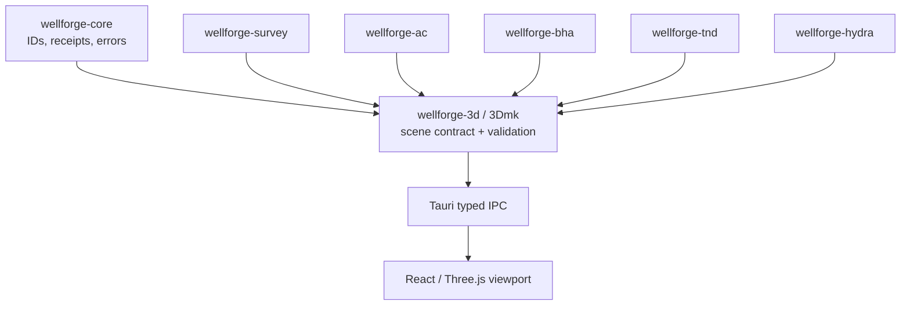

# 3Dmk Visualization Core Design

## Purpose

Make 3Dmk the single, reusable three-dimensional visualization capability for WellForge. The first capability is intentionally narrow: it displays validated wellbore paths and stations. Later consumers may use the same contract for anti-collision geometry, BHA assemblies, torque-and-drag load states, hydraulics volumes, and evidence geometry. 3Dmk is not an engineering solver: numerical capability crates own engineering results and submit immutable, typed scene content to it.

## Architectural Decision

Add `wellforge-3d` as a Rust crate and make it the sole owner of the versioned, renderer-neutral scene contract. The crate validates finite geometry, stable identifiers, units, coordinate frame, layer ordering, materials, selection metadata, and provenance. It produces `SceneDocumentV1`, which the Tauri command boundary serializes unchanged to the React renderer.

The first renderer is one lean WebGL2-backed Tauri viewport using the native WebView canvas API—no external scene library, framework, or generalized 3D editor. It receives `SceneDocumentV1`, performs no engineering calculations, and supports orbit/pan/zoom plus layer visibility. Native CUDA is the preferred later high-throughput compute backend; Vulkan/WebGPU is fallback. Neither may change scene semantics or fabricate engineering data. Before either accelerator ships, it must agree with the CPU scene/reference path under frozen tolerances and include backend provenance in its output.

## Ownership and Dependency Direction

- `wellforge-core` owns cross-capability identities, calculation receipts, units, and structured errors.
- `wellforge-3d` owns the V1 scene schema, validation, scene bounds, and renderer capability negotiation.
- Domain crates own engineering geometry and may adapt validated domain outputs to `SceneDocumentV1`; 3Dmk never derives survey, BHA, T&D, hydraulic, or AC values.
- The UI owns transient camera and panel state only. It does not calculate positions, interpolations, collision envelopes, or engineering attributes.

## V1 Scene Contract

`SceneDocumentV1` is immutable at the Tauri boundary and contains:

- `schemaVersion`: exactly `wellforge.scene/v1`.
- `sceneId`, `title`, and `coordinateFrame` (initially `north-east-tvd-m`).
- `layers`: ordered `SceneLayerV1` values with stable IDs, names, visibility defaults, materials, selectable flag, and one or more primitives.
- `primitives`: initially `polyline` and `marker` only. Each vertex is finite SI metres; all styles are declarative.
- `provenance`: calculation receipt or source identity, algorithm/profile version, input revision/hash, selected backend, and warnings.
- `bounds`: validated axis-aligned SI bounds calculated by Rust, never inferred by the UI.

The initial survey adapter emits a single `survey-path` polyline in NE-TVD coordinates and a station-marker layer. Its geometry comes only from cumulative `SurveyPosition` data. A user cannot type or drag an engineering station in the viewport.

## Failure Handling

- Non-finite coordinates, empty identifiers, unsupported schema versions, duplicate layer IDs, invalid colors, or missing provenance fail at the Rust boundary with structured `ApiError` values.
- IPC data is immediately runtime-validated against `wellforge.scene/v1` in the frontend before it enters UI state. The renderer rejects unknown schema versions, invalid coordinate frames, malformed primitives, and non-finite display coordinates; a TypeScript cast is not accepted as validation.
- If the WebGL viewport cannot initialize, the UI shows the returned scene metadata and a deterministic text error. It does not silently show an unrelated fallback visualization.
- A requested CUDA/Vulkan/WebGPU backend that is unavailable returns an explicit capability state. The CPU scene path is still valid only when it was explicitly selected or the request permits the declared fallback; the selected backend is recorded in provenance.

## Testing and Evidence

- Rust contract tests verify JSON schema identity, finite-coordinate rejection, stable scene bounds, duplicate-ID rejection, and scene-provenance preservation.
- Survey-to-scene tests prove NE-TVD coordinates transfer unchanged and that station markers preserve measured depth labels.
- Frontend tests verify scene panel loading, layer toggles, and selection details without calculating any trajectory values.
- Later GPU work adds CPU/CUDA and CPU/Vulkan/WebGPU parity fixtures before being enabled in an engineering workflow.

## Scope of This Slice

This vertical slice creates the 3Dmk V1 contract, a survey scene adapter, Tauri IPC command, one Three.js viewport, typed frontend contract/store, and tests. Mesh import, point-cloud rendering, pick-to-domain mapping, BHA solids, anti-collision ellipsoids, GPU compute, scene editing, and export are not represented or scaffolded here. They are separate capability increments after an actual engineering consumer requires them.
